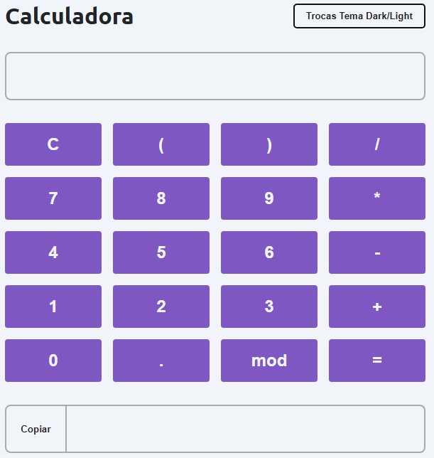
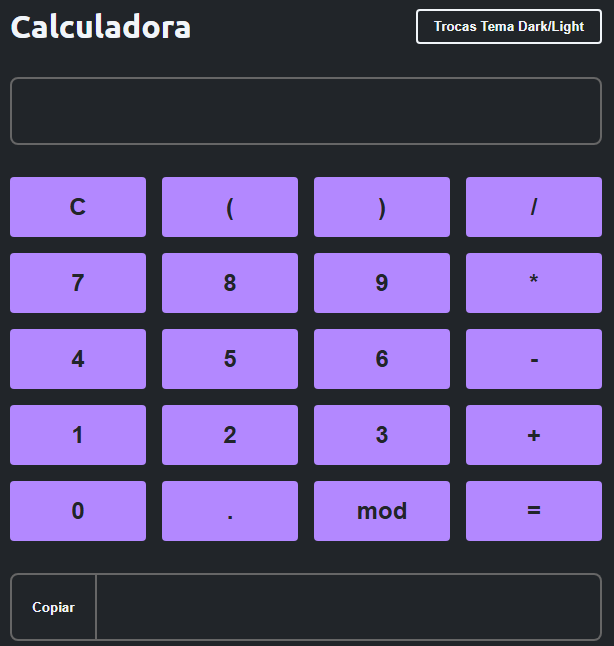

# 🧮 Calculadora DOM

Este projeto faz parte do meu estudo sobre manipulação do DOM em JavaScript. O objetivo é criar uma calculadora funcional com alternância de tema entre Light e Dark.

## 🚀 Funcionalidades

- 🧠 Realiza operações matemáticas básicas (+, -, *, /, %, parênteses).
- ⌨️ Permite digitar os valores pelo teclado ou clicar nos botões.
- 🧹 Botão “C” limpa o campo de entrada.
- 🟰 Botão “=” exibe o resultado.
- 📋 Botão “Copiar” copia o resultado para a área de transferência.
- 🌗 Botão “Trocas Tema Dark/Light” alterna entre os temas claro e escuro.

## 🏗️ Tecnologias Utilizadas

- HTML
- CSS (com variáveis para temas)
- JavaScript (Manipulação do DOM, eventos e clipboard)

## 📦 Estrutura do Projeto

```
02-DOM_Manipulacao_Calculadora/
│-- index.html      # Estrutura da página
│-- style.css       # Estilização e temas
│-- script.js       # Lógica da calculadora e interação com o DOM
│-- assets/         # Imagens do projeto (tema claro e escuro)
│   ├── dark-theme.png
│   └── light-theme.png
│-- README.md       # Documentação do projeto
```

## 🎯 Como Utilizar

1. Clone este repositório:
   ```sh
   git clone https://github.com/seu-usuario/estudos.git
   ```
2. Acesse a pasta do projeto:
   ```sh
   cd estudos/JavaScript/02-DOM_Manipulacao_Calculadora
   ```
3. Abra o arquivo `index.html` em um navegador.
4. Utilize a calculadora normalmente e alterne os temas conforme desejar.

## 🖼️ Visual do Projeto

### 💡 Tema Light


### 🌑 Tema Dark


## 🛠️ Melhorias Futuras

- [ ] Melhorar a responsividade para dispositivos móveis.
- [ ] Adicionar histórico de cálculos.
- [ ] Prevenir erros com entradas inválidas (ex: operadores duplicados).
- [ ] Adicionar suporte a teclado numérico virtual.

📌 **Última atualização:** `13/05/2025`
