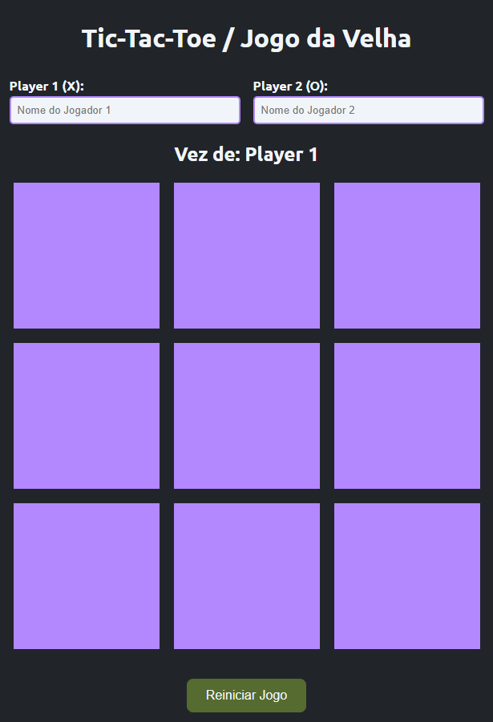

# 🎮 Jogo da Velha - Tic-Tac-Toe

Este projeto faz parte do meu estudo sobre manipulação do DOM e interatividade com JavaScript. O objetivo é desenvolver um jogo da velha (Tic-Tac-Toe) interativo, com destaque para alternância de jogadores, detecção de vitórias e empates, e uma interface visual agradável com tons de roxo.

## 🚀 Funcionalidades
- 🧑‍🤝‍🧑 Inclusão dos nomes dos dois jogadores antes do início da partida.
- 👥 Indicação clara de qual jogador está na vez.
- 🎯 Tabuleiro interativo com marcações de “X” e “O”.
- 🚫 Prevenção de jogadas em casas já preenchidas.
- 🏆 Detecção automática de vitória e destaque visual das casas vencedoras.
- 🤝 Mensagem de empate em caso de preenchimento completo sem vencedor.
- 🔁 Botão de reinício para jogar novamente com os mesmos jogadores.

## 🏗️ Tecnologias Utilizadas
- HTML
- CSS (com foco em variações de tons de roxo como identidade visual)
- JavaScript (Manipulação do DOM, lógica de jogo e eventos)

## 📦 Estrutura do Projeto
```
03-DOM_Manipulacao_Jogo_da_Velha/
│-- index.html     # Estrutura da interface
│-- style.css      # Estilização em tons de roxo
│-- script.js      # Lógica do jogo e interações
│-- README.md      # Documentação do projeto
```

## 🎯 Como Utilizar
1. Clone este repositório:
   ```sh
   git clone https://github.com/seu-usuario/estudos.git
   ```
2. Acesse a pasta do projeto:
   ```sh
   cd estudos/JavaScript/03-DOM_Manipulacao_Jogo_da_Velha
   ```
3. Abra o arquivo `index.html` em um navegador.
4. Insira os nomes dos jogadores e divirta-se jogando!

## 🖼️ Preview da Interface


## 🛠️ Melhorias Futuras
- [ ] Adicionar placar acumulativo de partidas.
- [ ] Criar um modo contra o computador (IA simples).
- [ ] Adaptar para dispositivos móveis com layout responsivo.
- [ ] Permitir escolha de símbolos personalizados além de “X” e “O”.

📌 **Última atualização:** `14/05/2025`
