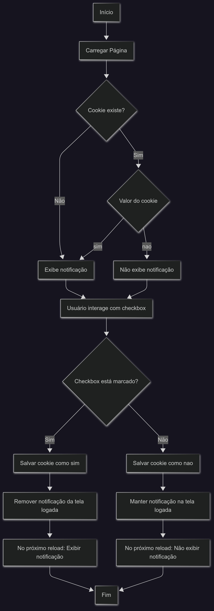
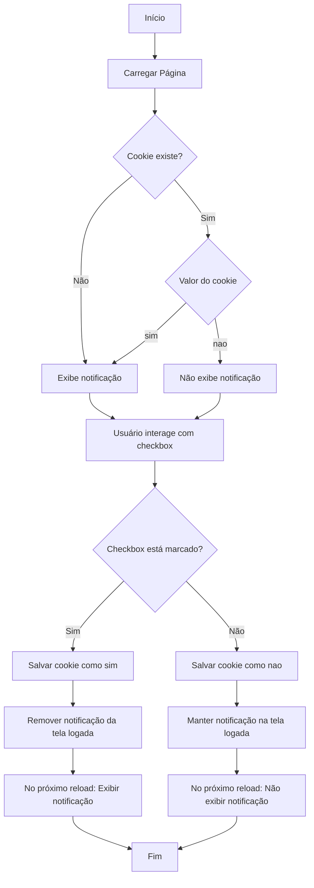
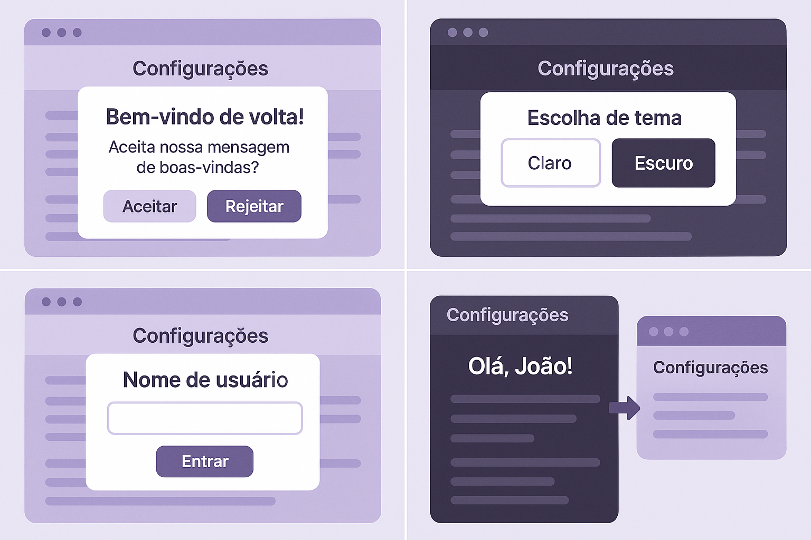

# 🌟 UserPreferences Pro – Sistema de Preferências de Usuário no Navegador

Este projeto faz parte do meu estudo sobre **Armazenamento Nativo no Navegador** com JavaScript. O objetivo é desenvolver um sistema de preferências que utiliza de forma prática e combinada os recursos de **Local Storage**, **Session Storage** e **Cookies**, demonstrando cenários reais de uso.

## 🚀 Funcionalidades
- 🎨 **Escolha de Tema (Claro ou Escuro)**  
  ⮕ Salvo usando **Local Storage** para persistir entre sessões.

- 🔐 **Login de Sessão Simples (Nome do Usuário)**  
  ⮕ Utiliza **Session Storage**, válido enquanto a aba estiver aberta.

- 🔔 **Popup de Boas-vindas**  
  ⮕ Gerenciado com **Cookies**, o usuário pode aceitar ou rejeitar a exibição dessa mensagem em visitas futuras.

- 🗂️ Demonstração clara de como os dados se comportam ao fechar a aba ou recarregar a página:
  - O **tema** permanece salvo (Local Storage).
  - O **login** some ao fechar a aba (Session Storage).
  - O **popup** respeita a escolha anterior (Cookies).

---

## 🔄 Fluxo da Exibição de Notificação

Este fluxograma representa a lógica de exibição e persistência da notificação com base no estado do **checkbox** e no valor armazenado nos **cookies**.

- Quando o usuário **marca** o checkbox (ativa):  
  - O cookie é salvo como `sim`;  
  - A notificação **some da tela logada**;  
  - No próximo reload, **a notificação volta a aparecer**.

- Quando o usuário **desmarca** o checkbox (desativa):  
  - O cookie é salvo como `nao`;  
  - A notificação **permanece visível** na tela logada;  
  - No próximo reload, **a notificação não é exibida**.

### 📊 Preview Fluxograma



### 🧭 Diagrama Mermaid



## 🏗️ Tecnologias Utilizadas
- HTML
- CSS (com foco em tons de roxo e tema claro/escuro)
- JavaScript
  - Manipulação do DOM
  - Eventos
  - Local Storage
  - Session Storage
  - Cookies

## 📦 Estrutura do Projeto
```
04-ArmazenamentoNav_UserPreferences/
│-- index.html     # Estrutura da interface
│-- style.css      # Estilização, temas e layout
│-- script.js      # Lógica de armazenamento e interações
│-- README.md      # Documentação do projeto
```

## 🎯 Como Utilizar
1. Clone este repositório:
   ```sh
   git clone https://github.com/seu-usuario/estudos.git
   ```
2. Acesse a pasta do projeto:
   ```sh
   cd estudos/JavaScript/04-ArmazenamentoNav_UserPreferences
   ```
3. Abra o arquivo `index.html` no navegador.
4. Interaja:
   - Defina o tema claro ou escuro.
   - Faça login com seu nome (persistente na aba).
   - Aceite ou recuse o popup de boas-vindas.

## 🖼️ Preview da Interface


## 🛠️ Melhorias Futuras
- [ ] Implementar armazenamento com **IndexedDB** para dados mais complexos.
- [ ] Adicionar opções de idioma como preferência salva no Local Storage.
- [ ] Melhorar responsividade para dispositivos móveis.
- [ ] Criar um modo de persistência do login com opção "Lembrar-me" utilizando Local Storage.

## 📐 Protótipo de Layout
O design atual segue um padrão moderno, minimalista, com tons de roxo e boa legibilidade. As telas foram planejadas para simular uma experiência real de um sistema web responsivo.

📌 **Última atualização:** `08/10/2025`
