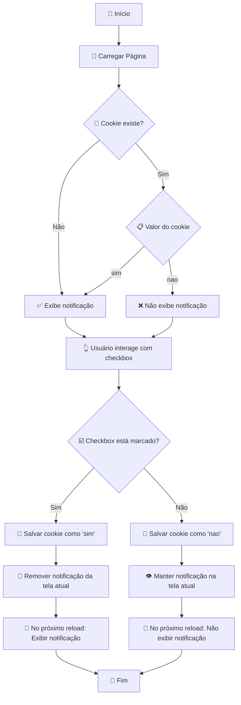

# 🌟 UserPreferences - Sistema de Preferências de Usuário no Navegador


## 📋 Sobre o Projeto

**UserPreferences** é um projeto educacional desenvolvido para demonstrar de forma prática e didática o funcionamento do **armazenamento nativo no navegador** utilizando as APIs de **Local Storage**, **Session Storage** e **Cookies**.

Este projeto faz parte dos meus estudos em JavaScript, com foco na criação de aplicações web que oferecem uma experiência personalizada ao usuário através de persistência de dados no lado do cliente.

---

## ✨ Funcionalidades

### 🎨 Gerenciamento de Tema
- Alternância entre tema claro e escuro
- Persistência da preferência usando **Local Storage**
- Animações suaves na transição de temas
- Interface responsiva e acessível

### 🔐 Autenticação de Sessão
- Sistema de login simples com validação
- Armazenamento usando **Session Storage**
- Dados válidos apenas enquanto a aba estiver aberta
- Mensagem de boas-vindas personalizada

### 🔔 Sistema de Notificações
- Painel configurável de notificações
- Preferências salvas usando **Cookies**
- Controle granular de exibição
- Persistência entre sessões do navegador

---

## 🛠️ Tecnologias Utilizadas

- **HTML5** - Estrutura semântica e acessível
- **CSS3** - Estilização moderna com variáveis CSS e animações
- **JavaScript (ES6+)** - Lógica de negócio e manipulação do DOM
  - Programação Orientada a Objetos
  - Module Pattern
  - Event Delegation
  - Local Storage API
  - Session Storage API
  - Cookies API

---

## 📂 Estrutura do Projeto

```
UserPreferences/
│
├── index.html          # Estrutura HTML semântica
├── style.css           # Estilização com CSS moderno
├── script.js           # Lógica JavaScript modular
├── README.md           # Documentação do projeto
├── preview.png         # Captura de tela do projeto
└── notificationFlow.png # Diagrama do fluxo de notificações
```

---

## 🔄 Fluxo de Notificações

O sistema de notificações implementa uma lógica específica baseada no estado do checkbox e no valor armazenado nos cookies:

### Comportamento do Sistema

| Estado do Checkbox | Ação | Cookie Salvo | Próximo Reload |
|-------------------|------|--------------|----------------|
| ✅ Marcado (Ativo) | Notificação some da tela | `sim` | Notificação reaparece |
| ❌ Desmarcado (Inativo) | Notificação permanece visível | `nao` | Notificação não é exibida |

### 📊 Preview Fluxograma


### 📊 Diagrama de Fluxo



---

## 🚀 Como Utilizar

### Instalação Local

1. **Clone o repositório:**
   ```bash
   git clone https://github.com/Reinaldo-rs/Estudos.git
   ```

2. **Acesse a pasta do projeto:**
   ```bash
   cd estudos/JavaScript/UserPreferences
   ```

3. **Abra o arquivo no navegador:**

   ⚠️ **IMPORTANTE**: Para que os **Cookies** funcionem corretamente, você precisa servir o projeto através de um servidor local. Abrir o arquivo diretamente (`file://`) fará com que o navegador bloqueie cookies por questões de segurança.

   **Opção A - Usar um servidor local (Recomendado):**
   
   ```bash
   # Usando Python 3
   python -m http.server 8000
   
   # Usando Python 2
   python -m SimpleHTTPServer 8000
   
   # Usando Node.js (npx http-server)
   npx http-server -p 8000
   
   # Usando PHP
   php -S localhost:8000
   ```
   
   Depois acesse: `http://localhost:8000`

   **Opção B - Usar extensões do VSCode:**
   - [Live Server](https://marketplace.visualstudio.com/items?itemName=ritwickdey.LiveServer) (Eu uso essa)
   - [Preview on Web Server](https://marketplace.visualstudio.com/items?itemName=yuichinukiyama.vscode-preview-server)

   **Opção C - Abrir diretamente (Funcionalidade Limitada):**
   ```bash
   # No Linux/Mac
   open index.html
   
   # No Windows
   start index.html
   
   # Ou simplesmente arraste o arquivo para o navegador
   ```
   
   ⚠️ **Nesta opção**: Local Storage e Session Storage funcionarão normalmente, mas **Cookies NÃO funcionarão** devido às políticas de segurança do navegador (same-origin policy).

### 🔍 Verificando se está funcionando corretamente

Após abrir o projeto, abra o **DevTools** (F12) e verifique:

1. **Console**: Não deve haver erros relacionados a cookies
2. **Application/Storage**: 
   - ✅ Local Storage: Deve armazenar o tema
   - ✅ Session Storage: Deve armazenar o usuário
   - ✅ Cookies: Deve armazenar as preferências de notificação

Se os cookies aparecerem como bloqueados ou vazios, você está abrindo via `file://` e precisa usar um servidor local.

### Utilização

1. **Defina seu tema preferido** usando o botão de alternância no canto superior direito
2. **Faça login** com seu nome na tela inicial
3. **Configure as notificações** de acordo com sua preferência
4. **Teste o comportamento**:
   - Recarregue a página → tema permanece (Local Storage)
   - Feche e reabra a aba → login desaparece (Session Storage)
   - Recarregue após configurar notificações → preferência mantida (Cookies)

---

## ⚠️ Troubleshooting

### Problema: Cookies não estão sendo salvos

**Causa**: Você está abrindo o arquivo diretamente pelo sistema de arquivos (`file://`).

**Solução**: Use um servidor local conforme instruções acima.

**Como verificar**: 
- Olhe na barra de endereços do navegador
- Se começar com `file://` → ❌ Cookies bloqueados
- Se começar com `http://` → ✅ Cookies funcionando

### Problema: Notificações não persistem entre sessões

**Causa**: Mesma do problema anterior - cookies bloqueados.

**Solução**: Servidor local obrigatório para esta funcionalidade.

### Problema: Tema e Login funcionam, mas notificações não

**Diagnóstico**: Local Storage e Session Storage funcionam em `file://`, mas cookies não.

**Solução**: Migre para servidor local para funcionalidade completa.

---

## 📊 Comparação de Métodos de Abertura

| Método | Local Storage | Session Storage | Cookies | Recomendado |
|--------|---------------|-----------------|---------|-------------|
| Arquivo direto (`file://`) | ✅ | ✅ | ❌ | ❌ |
| Servidor local (`http://`) | ✅ | ✅ | ✅ | ✅ |

**Para experiência completa: use servidor local!** 🎉

---

## 💡 Conceitos Demonstrados

### Local Storage
- ✅ Armazenamento persistente entre sessões
- ✅ Ideal para preferências de usuário
- ✅ Dados permanecem mesmo após fechar o navegador
- ✅ Funciona em `file://` e `http://`

### Session Storage
- ✅ Armazenamento temporário por sessão
- ✅ Dados válidos apenas enquanto a aba estiver aberta
- ✅ Ideal para dados sensíveis ou temporários
- ✅ Funciona em `file://` e `http://`

### Cookies
- ✅ Armazenamento com data de expiração configurável
- ✅ Suporte a caracteres especiais via Base64
- ✅ Compartilhado entre abas e janelas do mesmo domínio
- ⚠️ **Requer servidor local** (`http://`) para funcionar

---

## 🎨 Características de Design

- **Interface Moderna** - Design clean com gradientes e glassmorphism
- **Tema Dual** - Suporte completo para modo claro e escuro
- **Animações Fluidas** - Transições suaves em todas as interações
- **Responsivo** - Adaptável a diferentes tamanhos de tela
- **Acessível** - Seguindo boas práticas de acessibilidade (ARIA labels)

---

## 📚 Arquitetura do Código

O projeto foi refatorado seguindo princípios de **Clean Code**:

### Estrutura Modular

```javascript
CONFIG                    // Configurações centralizadas
  └── Storage            // Camada de persistência
      └── DOM            // Gerenciamento de elementos
          └── Managers   // Lógica de negócio
              ├── ThemeManager
              ├── AuthManager
              └── NotificationManager
          └── EventManager // Gerenciamento de eventos
      └── App            // Inicialização
```

### Princípios Aplicados

- ✅ **Single Responsibility Principle** - Cada módulo tem uma única responsabilidade
- ✅ **DRY (Don't Repeat Yourself)** - Reutilização máxima de código
- ✅ **Separation of Concerns** - Separação clara entre lógica, apresentação e dados
- ✅ **Naming Conventions** - Nomes claros e autodocumentados
- ✅ **Error Handling** - Tratamento de erros em pontos críticos

---

## 🔧 Melhorias Futuras

- [ ] Implementar **IndexedDB** para dados mais complexos
- [ ] Adicionar suporte a múltiplos idiomas (i18n)
- [ ] Criar testes unitários com Jest
- [ ] Implementar Service Worker para funcionalidade offline
- [ ] Adicionar opção "Lembrar-me" no login usando Local Storage
- [ ] Criar dashboard com estatísticas de uso
- [ ] Implementar sistema de exportação/importação de preferências

---

## 🤝 Contribuindo

Contribuições são bem-vindas! Para contribuir:

1. Faça um fork do projeto
2. Crie uma branch para sua feature (`git checkout -b feature/MinhaFeature`)
3. Commit suas mudanças (`git commit -m 'Adiciona MinhaFeature'`)
4. Push para a branch (`git push origin feature/MinhaFeature`)
5. Abra um Pull Request

---

## 📄 Licença

Este projeto está sob a licença MIT. Veja o arquivo `LICENSE` para mais detalhes.

---

## 👨‍💻 Autor

Desenvolvido com 💜 como parte dos meus estudos em JavaScript e Web Development.

---

## 📞 Contato

- GitHub: [@Reinaldo-rs](https://github.com/Reinaldo-rs)
- LinkedIn: [Reinaldo Soares](https://www.linkedin.com/in/reinaldo-rs/)
- Email: reinaldo.rsoares@hotmail.com

---

## 🙏 Agradecimentos

Agradecimentos especiais à comunidade JavaScript por todo o conhecimento compartilhado e aos recursos educacionais que tornaram este projeto possível.

---

<div align="center">

**📌 Última atualização:** `10/10/2025`

⭐ Se este projeto foi útil para você, considere dar uma estrela!

</div>