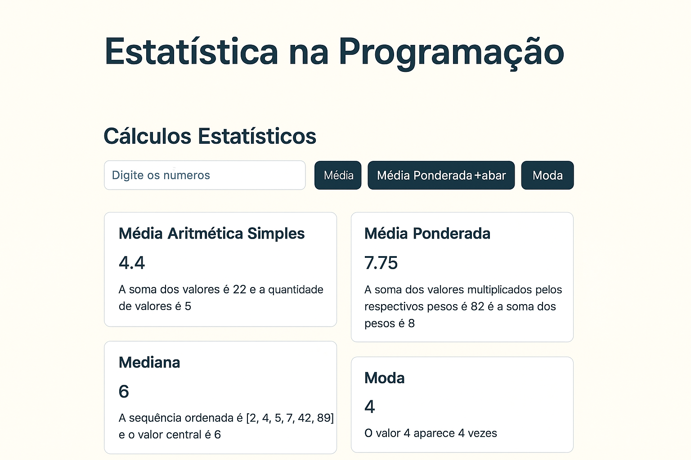

# 📊 Estatística na Programação – Funções Matemáticas com JavaScript Moderno



## 📋 Sobre o Projeto

**Estatística na Programação** é um projeto educacional desenvolvido para demonstrar o uso de **funções JavaScript modernas (ES6+)**, com foco em **arrow functions**, **parâmetros dinâmicos** e **tratamento de coleções numéricas**.  

O objetivo é aplicar conceitos estatísticos fundamentais — **média**, **mediana**, **moda** e **média ponderada** — de forma prática, visual e interativa através de uma **interface web leve e intuitiva**.

---

## ✨ Funcionalidades

### 🧮 Cálculos Estatísticos
- **Média Aritmética Simples**: Soma dos valores dividida pela quantidade total  
- **Média Ponderada**: Cada valor tem um peso proporcional definido pelo usuário  
- **Mediana**: Valor central da sequência (ou média dos dois centrais)  
- **Moda**: Valor que mais se repete no conjunto

### 💻 Interface Interativa
- Entrada de dados via formulário simples
- Exibição imediata dos resultados no navegador
- Feedback textual e visual para cada cálculo
- Responsividade para desktop e mobile

### 🚀 Recursos Técnicos
- Arrow functions com **rest parameters (`...valores`)**
- Manipulação de arrays com **map**, **reduce**, **sort**, **filter**
- Atualização dinâmica do DOM sem recarregar a página

---

## 🛠️ Tecnologias Utilizadas

- **HTML5** – Estrutura semântica da página  
- **CSS3** – Layout e design moderno com transições suaves  
- **JavaScript (ES6+)** – Lógica funcional e modular  
  - Arrow functions  
  - Rest parameters  
  - Desestruturação  
  - Manipulação de Arrays  

---

## 📂 Estrutura do Projeto

```
EstatisticaNaProgramacao/
│
├── index.html       # Interface e estrutura base
├── style.css        # Estilo visual e responsividade
├── script.js        # Funções estatísticas e interação
├── README.md        # Documentação do projeto
└── preview.png      # Captura de tela da interface
```

---

## 🔢 Exemplos de Uso

### Média Aritmética Simples
```javascript
const media = (...numeros) => 
  numeros.reduce((acc, n) => acc + n, 0) / numeros.length;

media(2, 6, 3, 7, 4); // 4.4
```

### Média Ponderada
```javascript
const mediaPonderada = (...entradas) => {
  const total = entradas.reduce((acc, { n, p }) => acc + n * p, 0);
  const somaPesos = entradas.reduce((acc, { p }) => acc + p, 0);
  return total / somaPesos;
};

mediaPonderada({ n: 7, p: 2}, { n: 9, p: 5 }, { n: 3, p: 1 }); // 7.75
```

### Mediana
```javascript
const mediana = (...numeros) => {
  const ordenados = [...numeros].sort((a, b) => a - b);
  const meio = Math.floor(ordenados.length / 2);
  return ordenados.length % 2 !== 0
    ? ordenados[meio]
    : media(ordenados[meio - 1], ordenados[meio]);
};

mediana(2, 4, 5, 7, 42, 99); // 6
```

### Moda
```javascript
const moda = (...numeros) => {
  const frequencias = numeros
    .map(num => [num, numeros.filter(n => n === num).length]);
  frequencias.sort((a, b) => b[1] - a[1]);
  return frequencias[0][0];
};

moda(1, 1, 5, 4, 9, 7, 4, 3, 5, 2, 4, 0, 4); // 4
```

---

## 🎨 Interface do Projeto

O projeto conta com uma interface amigável composta por:

| Elemento | Função |
|-----------|--------|
| 🔢 Campo de entrada | Permite inserir números ou objetos com peso |
| ⚙️ Botões de operação | Executam cada cálculo (média, mediana etc.) |
| 💬 Área de resultado | Exibe o cálculo e a explicação do processo |
| 🎨 Estilo visual | Baseado em tons suaves, com feedbacks coloridos |

---

## 🚀 Como Executar Localmente

1. **Clone o repositório:**
   ```bash
   git clone https://github.com/Reinaldo-rs/Estudos.git
   ```

2. **Acesse a pasta do projeto:**
   ```bash
   cd estudos/JavaScript/EstatisticaNaProgramacao
   ```

3. **Abra o arquivo `index.html`** no navegador  
   ou utilize o **Live Server** no VSCode para ter uma experiência completa.

---

## 💡 Conceitos Aplicados

- **Funções Matemáticas com JavaScript**
- **Arrow Functions e Rest Parameters**
- **Array.reduce()**, **Array.sort()**, **Array.filter()**
- **Manipulação dinâmica de DOM**
- **Design Responsivo e Acessível**

---

## 🔧 Possíveis Extensões Futuras

- [ ] Adicionar gráficos com **Chart.js**
- [ ] Permitir salvar histórico dos cálculos (Local Storage)
- [ ] Exportar resultados em PDF
- [ ] Suporte a múltiplas linguagens (i18n)
- [ ] Implementar testes unitários com Jest

---

## 👨‍💻 Autor

Desenvolvido por **Reinaldo Soares** 💜  
Como parte dos meus estudos contínuos em **JavaScript Moderno** e **Desenvolvimento Web**.

---

## 📞 Contato

- GitHub: [@Reinaldo-rs](https://github.com/Reinaldo-rs)  
- LinkedIn: [Reinaldo Soares](https://www.linkedin.com/in/reinaldo-rs/)  
- Email: reinaldo.rsoares@hotmail.com

---

<div align="center">

**📘 Última atualização:** `16/10/2025`  
⭐ Se este projeto te ajudou, considere deixar uma estrela!

</div>
